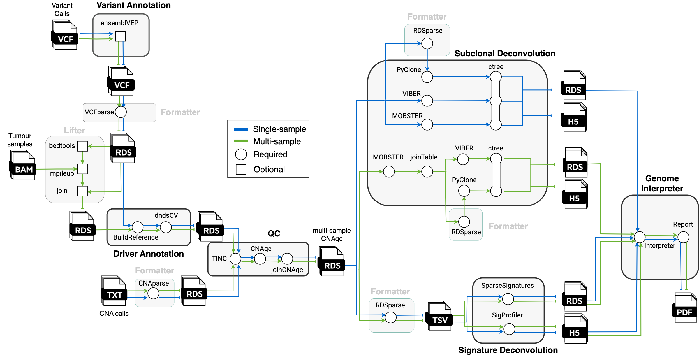

# 

**Tumour evolution from WGS data**

[](https://github.com/nf-core/tumourevo/actions)
[](https://github.com/nf-core/tumourevo/actions)
[](https://www.nextflow.io/)

[](http://bioconda.github.io/)
[](https://hub.docker.com/r/nfcore/tumourevo)

## Introduction
**nf-core/tumourevo** is a bioinformatics pipeline to model tumour evolution from whole-genome sequencing (WGS) data. The pipeline performs state-of-the-art downstream analysis of variant and copy-number calls from tumour-normal matched sequecing assays, reconstructing the evolutionary processes leading to the observed tumour genome. This analysis can be done  at the level of single samples, multiple samples from the same patient (multi-region/longitudinal assays), and of multiple patients from distinct cohorts.

The pipeline is built using [Nextflow](https://www.nextflow.io), a workflow tool to run tasks across multiple compute infrastructures in a very portable manner. It comes with docker containers making installation trivial and results highly reproducible. The [Nextflow DSL2]([https://www.nextflow.io](https://www.nextflow.io/docs/latest/dsl1.html)) implementation of this pipeline uses one container per process which makes it easier to maintain and update software dependencies. Where possible, these processes have been submitted to and installed from [nf-core/modules](https://github.com/nf-core/modules) in order to make them available to all nf-core pipelines, and to everyone within the Nextflow community!

<p align="center">
    
</p>


## Pipeline Summary

- Quality Control (`CNAqc`, `TINC`)
- Variant Annotation (`VEP`, `maftools`)
- Driver Annotation (`SOPRANO`, `dndsCV`)
- Subclonal Deconvolution (`PyClone`, `MOBSTER`, `VIBER`)
- Clone Tree Inference (`ctree`)
- Signature Deconvolution (`SparseSignatures`, `SigProfiler`)
- Genome Interpreter

## Quick Start

i. Install [`nextflow`](https://nf-co.re/usage/installation)

ii. Install either [`Docker`](https://docs.docker.com/engine/installation/) or [`Singularity`](https://www.sylabs.io/guides/3.0/user-guide/) for full pipeline reproducibility (please only use [`Conda`](https://conda.io/miniconda.html) as a last resort; see [docs](https://nf-co.re/usage/configuration#basic-configuration-profiles))

iii. Download the pipeline and test it on a minimal dataset with a single command

```bash
nextflow run nf-core/tumourevo -profile test,<docker/singularity/conda/institute>
```

> Please check [nf-core/configs](https://github.com/nf-core/configs#documentation) to see if a custom config file to run nf-core pipelines already exists for your Institute. If so, you can simply use `-profile <institute>` in your command. This will enable either `docker` or `singularity` and set the appropriate execution settings for your local compute environment.

iv. Start running your own analysis!

<!-- TODO nf-core: Update the default command above used to run the pipeline -->

```bash
nextflow run nf-core/tumourevo -profile <docker/singularity/conda/institute> --reads '*_R{1,2}.fastq.gz' --genome GRCh37
```

See [usage docs](docs/usage.md) for all of the available options when running the pipeline.

## Documentation

The nf-core/tumourevo pipeline comes with documentation about the pipeline, found in the `docs/` directory:

1. [Installation](https://nf-co.re/usage/installation)
2. Pipeline configuration
    * [Local installation](https://nf-co.re/usage/local_installation)
    * [Adding your own system config](https://nf-co.re/usage/adding_own_config)
    * [Reference genomes](https://nf-co.re/usage/reference_genomes)
3. [Running the pipeline](docs/usage.md)
4. [Output and how to interpret the results](docs/output.md)
5. [Troubleshooting](https://nf-co.re/usage/troubleshooting)

<!-- TODO nf-core: Add a brief overview of what the pipeline does and how it works -->

## Credits

nf-core/tumourevo was originally written by Nicola Calonaci, Elena Buscaroli, Katsiaryna Davydzenka, Giorgia Gandolfi, Virginia Gazziero, Asad Sadr, Lucrezia Valeriani and Giulio Caravagna.

## Contributions and Support

If you would like to contribute to this pipeline, please see the [contributing guidelines](.github/CONTRIBUTING.md).

For further information or help, don't hesitate to get in touch on [Slack](https://nfcore.slack.com/channels/tumourevo) (you can join with [this invite](https://nf-co.re/join/slack)).

## Citation

<!-- TODO nf-core: Add citation for pipeline after first release. Uncomment lines below and update Zenodo doi. -->
<!-- If you use  nf-core/tumourevo for your analysis, please cite it using the following doi: [10.5281/zenodo.XXXXXX](https://doi.org/10.5281/zenodo.XXXXXX) -->

You can cite the `nf-core` publication as follows:

> **The nf-core framework for community-curated bioinformatics pipelines.**
>
> Philip Ewels, Alexander Peltzer, Sven Fillinger, Harshil Patel, Johannes Alneberg, Andreas Wilm, Maxime Ulysse Garcia, Paolo Di Tommaso & Sven Nahnsen.
>
> _Nat Biotechnol._ 2020 Feb 13. doi: [10.1038/s41587-020-0439-x](https://dx.doi.org/10.1038/s41587-020-0439-x).  
> ReadCube: [Full Access Link](https://rdcu.be/b1GjZ)
